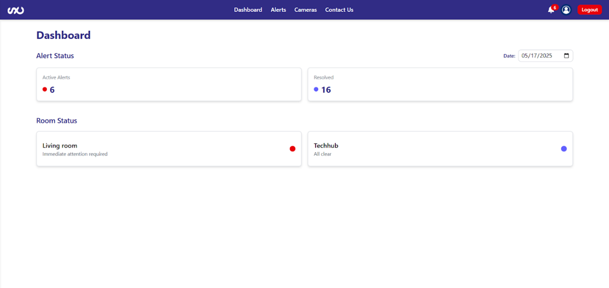
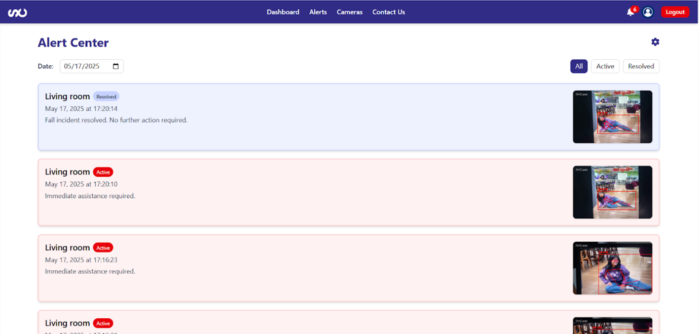
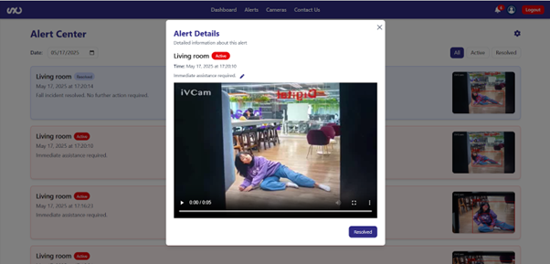
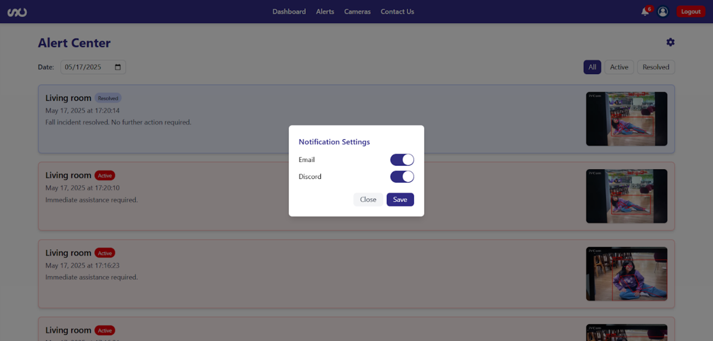
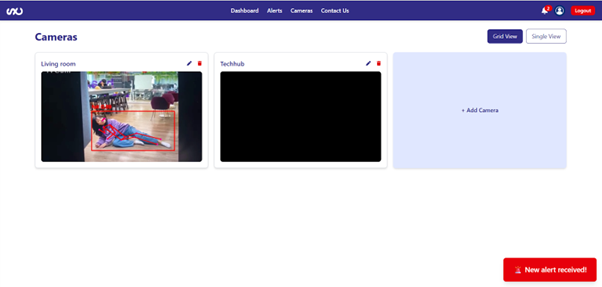
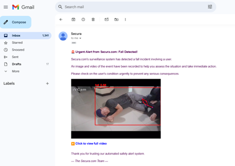
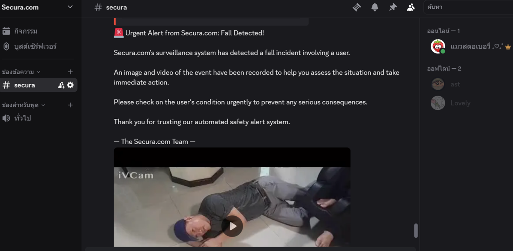

# Secura Web App

---

## เกี่ยวกับแพลตฟอร์ม

**Secura Web App** คือแพลตฟอร์มเว็บแอปที่มุ่งเน้นด้าน **การเฝ้าระวังเหตุการณ์ฉุกเฉินและแจ้งเตือนแบบเรียลไทม์** โดยเฉพาะสำหรับผู้สูงอายุหรือกลุ่มเป้าหมายที่ต้องการความปลอดภัย

คุณสมบัติเด่น:
- ตรวจจับการล้มของผู้ใช้ด้วย **YOLOv11 Pose Estimation** พร้อม **การวิเคราะห์ความเร็วการเคลื่อนไหว** เพื่อความแม่นยำ
- แจ้งเตือนทันทีผ่าน **Email, Discord หรือ Dashboard** เมื่อเกิดเหตุฉุกเฉิน
- ใช้งานง่ายและยืดหยุ่น รองรับการติดตั้งหลายกล้องและการเข้าถึงข้อมูลฉุกเฉินอย่างรวดเร็ว

---

## Features

- **Fall Detection** – ตรวจจับการล้มและพฤติกรรมผิดปกติ
- **Real-Time Alerts** – แจ้งเตือนทันทีผ่าน Email, Discord หรือ Dashboard
- **Multi-Camera & RTSP** – รองรับหลายกล้อง รวมถึงกล้อง IP RTSP
- **Dashboard** – อินเตอร์เฟซใช้งานง่าย แสดงสถานะเรียลไทม์

---

## ประโยชน์ที่ได้รับ

| ประโยชน์หลัก | รายละเอียด |
|---------------|------------|
| **เสริมความปลอดภัยผู้สูงอายุ** | ตรวจจับการล้มได้แม่นยำ ช่วยให้เข้าช่วยเหลือเร็ว |
| **ลดเวลาเกิดผลกระทบจากอุบัติเหตุ** | การแจ้งเตือนทันทีช่วยให้เรียกความช่วยเหลือได้ทันเวลา |
| **ระบบยืดหยุ่น ใช้งานง่าย** | รองรับหลายกล้อง ติดตั้งได้ทั้งบ้านหรือสถานที่แวดล้อม |
| **เพิ่มความมั่นใจให้ผู้ดูแล** | ติดตามเหตุการณ์ผ่าน Dashboard หรือระบบแชทที่เชื่อมต่อ |

---

## Use Cases

- **บ้านพักคนชรา**: ติดตั้งกล้องเฝ้าดูแบบเรียลไทม์ หากผู้สูงวัยล้มลง ระบบส่งคลิปวิดีโอสั้นพร้อมตำแหน่งผ่าน Discord หรือ Email
- **โรงพยาบาล/ศูนย์ดูแลระยะสั้น**: ตรวจคนไข้ที่อาจลื่นล้มในห้องพัก เพื่อให้เจ้าหน้าที่เข้าช่วยเหลือทันที

---

## เทคโนโลยีที่ใช้

- **Frontend:** React.js, TailwindCSS
- **Backend:** Node.js, Express
- **AI:** YOLOv11 Pose Estimation
- **Database:** MongoDB
- **Storage:** AWS S3
- **Notification:** Email API, Discord Webhook

---

## Screenshots / ตัวอย่างการใช้งาน

### หน้า Dashboard

### หน้า Alert Center

### หน้า Alert Details

### การตั้งค่าของ Alerts

### หน้า Cameras

### การแจ้งเตือนผ่าน Email

### การแจ้งเตือนผ่าน Discord

---

> ลิงก์โปรเจกต์: [Secura Web App](https://secura-web-app-psi.vercel.app/?fbclid=PAQ0xDSwMZlnBleHRuA2FlbQIxMAABp_Nx4Anryu_Ff0yXSJY2AebCQHXtmBlxrt_4keFSN_3R48T6BfoG8aPyR7M9_aem__82mia0sAjJtOZXUvXymfA)
